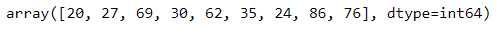

<h2>Date  :</h2>

<h2 >Exp: 02 </h2>
  
<h1>Implementation of Simple Linear Regression Model for Predicting the Marks Scored</h1> 

## AIM:
To write a program to predict the marks scored by a student using the simple linear regression model.

## Equipments Required:
1. Hardware – PCs
2. Anaconda – Python 3.7 Installation / Jupyter notebook

## Algorithm
1. Import libraries
2. Read csv file and set variables for assigning dataset values
3. Import Linear Regression from sklearn
4. assign the points and predict the regression
5. plot the graph and end the program

## Program:

Program to implement the simple linear regression model for predicting the marks scored.

<h3>Developed by: Sabari Akash A</h3>
<h3>RegisterNumber: 212222230124</h3>

```python
import pandas as pd
import numpy as np
import matplotlib.pyplot as plt
#import libraries to find mae, mse
from sklearn.metrics import mean_absolute_error,mean_squared_error
#read csv file
df=pd.read_csv('student_scores.csv')
#displaying the content in datafile
df
# Segregating data to variables
x=df.iloc[:,:-1].values
x
y=df.iloc[:,1].values
y
#splitting train and test data
from sklearn.model_selection import train_test_split
X_train,X_test,Y_train,Y_test=train_test_split(x,y,test_size=1/3,random_state=0)
#import linear regression model and fit the model with the data
from sklearn.linear_model import LinearRegression
regressor=LinearRegression()
regressor.fit(X_train,Y_train)
Y_Pred=regressor.predict(X_test)
#displaying predicted values
Y_Pred
#displaying actual values
Y_test
#graph plot for training data
plt.scatter(X_train,Y_train,color='red')
plt.plot(X_train,regressor.predict(X_train),color='blue')
plt.title("Hours Vs Scores(Training Set)")
plt.xlabel("Hours")
plt.ylabel('Scores')
plt.show()
#graph plot for test data
plt.scatter(X_train,Y_train,color="blue")
plt.plot(X_test,regressor.predict(X_test),color='orange')
plt.title("Hours Vs Scores(Test Set)")
plt.xlabel("Hours")
plt.ylabel("Scores")
plt.show()
#find mae,mse,rmse
mse=mean_squared_error(Y_test,Y_Pred)
print("MSE=",mse)
mae=mean_absolute_error(Y_test,Y_Pred)
print("MAE=",mae)
rsme=np.sqrt(mse)
print("RSME=",rsme)
```
## Output:
### Displaying the content in datafile:

### Segregating data to variables:
**X =**


**Y=**

### Displaying predicted values:

### Displaying actual values:

### graph plot for training data:


### graph plot for test data:


### MSE:

### MAE:

### RSME:


## Result:
Thus the program to implement the simple linear regression model for predicting the marks scored is written and verified using python programming.
